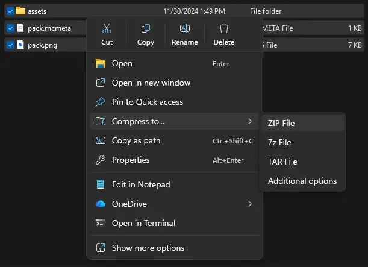

import Tabs from '@theme/Tabs';
import TabItem from '@theme/TabItem';

# Upload Your Own Resource Pack

##### In this guide, we'll show you step-by-step how to upload your own resource pack.

You have your own resource pack but don't know how to upload it to your Realm? No problem.

    1. You need a direct download link for your resource pack.

It doesn't matter how you host the resource pack, you have to have a direct download link to the pack file.
This guide will show you multiple ways of hosting your resource pack. You're free to use which option fits your needs, though.

Firstly, you need to archive your resource pack into a ZIP file.
When doing that, it's important to archive all files inside the main resource pack directory together instead of the entire one as seen in the image below.



<Tabs>
    <TabItem value="gdrive" label="Google Drive" default>
        One way would be to upload the resource pack to Google Drive and get a direct download link from there.
        To do that, upload the ZIP archive on the Google Drive website using Drag and Drop.

        Next, you click on the uploaded file in the Google Drive directory, and you execute the keyboard shortcut `CTRL+ALT+A`.
        After that you change the value **Restricted** under the heading **General Access** to **Everyone with the link** and finally you click on **copy link**.

        Now you visit the following website: <a href="https://lonedev6.github.io/gddl/">https://lonedev6.github.io/gddl/</a> and you paste the link you've received earlier in the input field and click on **Get direct link**.
        With that you get a direct download link to the resource pack file you can use for the next few steps.
    </TabItem>
    <TabItem value="mcpacks" label="MC-Packs">
        Another way of hosting a resource pack is by using a designated resource pack host.
        One of the most recommended ones is <a href="https://mc-packs.net">MC-Packs</a> for example.

        To use it, visit its website, upload the ZIP archive, complete the Captcha and click on **Upload**.

        After successfully uploading the file you have a text box at the right hand side with the values you'll need for the later steps.
    </TabItem>
</Tabs>

    2. Open the web interface of your Realm.

    3. Navigate to the **[Files](../web-interface/file-manager)** section.

    4. Look for the file called `server.properties` and click on it.

    5. Search for the line `resource-pack=` using CTRL + F.

    6. Paste the url at the end of that line. 

        For example: `resource-pack=https://example.com/resourcepack.zip`
        
    7. It's recommended to also include the SHA1-Hash of the resource pack. For this look [below](#generate-sha1-of-resource-pack).

        Paste this SHA1-Hash in the `resource-pack-sha1=` line.
       
        For example: `resource-pack-sha1=da39a3ee5e6b4b0d3255bfef95601890afd80709`

    8. Save the file and restart your Realm.

### Generate SHA1 of resource pack

You can use an online tool like https://emn178.github.io/online-tools/sha1_checksum.html.

The SHA1 can also be generated using the command:

<Tabs>
    <TabItem value="windows" label="Windows" default>
        Execute the following command in a PowerShell window:

        ```powershell
        Get-FileHash resourcePack.zip -Algorithm SHA1
        ```
    </TabItem>
    <TabItem value="linux" label="Linux">
        Execute the following command in a Terminal window:

        ```bash
        sha1sum resourcePack.zip
        ```
    </TabItem>
</Tabs>