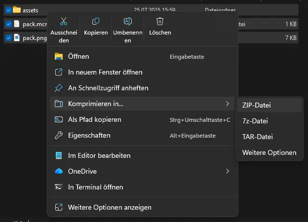

import Tabs from '@theme/Tabs';
import TabItem from '@theme/TabItem';

# Eigenes Resource-Pack hochladen

##### In diesem Guide zeigen wir dir Schritt für Schritt, wie du dein eigenes Resource-Pack hochladen kannst.

Du hast ein eigenes Resource-Pack und weißt nicht, wie du es auf deinen Realm hochladen sollst? Kein Problem.

    1. Du benötigst einen direkten Download-Link für dein Resource-Pack.

Wie man das Resource-Pack hostet steht einem frei, solange es einen direkten Download-Link gibt, den der Minecraft-Client verarbeiten kann.
In diesem Guide werden dir unterschiedliche Möglichkeiten gezeigt, wie du ein Resource-Pack hosten kannst.
Je nachdem, welche Möglichkeit dir besser passt, kannst du diese nutzen.

Zuallererst musst du das Resource-Pack in ein ZIP-Archiv umwandeln.
Hierbei ist es wichtig, dass du nicht den Ordner archivierst, in dem sich das Resource-Pack befindet, sondern wie im Bild gezeigt alle in diesem Ordner befindlichen Dateien und Ordner auswählst und gemeinsam archivierst.



<Tabs>
    <TabItem value="gdrive" label="Google Drive" default>
        Eine Möglichkeit wäre, das Resource-Pack auf Google Drive hochzuladen und einen teilbaren Direktlink zu erstellen.
        Hierzu lädst du zuerst die ZIP-Datei am einfachsten über Drag-and-Drop auf der Google-Drive Website hoch.

        Als nächstes klickst du die Datei an und drückst die Tastenkombination `STRG+ALT+A`.
        Dann änderst du bei der Überschrift **Genereller Zugriff** den Wert **Eingeschränkt** auf **Jeder mit dem Link** und klickst dann auf **Link kopieren**.

        Anschließend besuchst du die folgende Website: <a href="https://lonedev6.github.io/gddl/">https://lonedev6.github.io/gddl/</a> und fügst den Link, den du eben bekommen hast, ein und klickst dann auf **Get direct link**.
        Damit bekommst du einen direkten Download-Link zum Resource-Pack, welches du in den späteren Schritten nutzen kannst.
    </TabItem>
    <TabItem value="mcpacks" label="MC-Packs">
        Eine weitere Möglichkeit besteht darin, einen speziell für Resource-Packs ausgelegten Host zu nutzen.
        Der am meisten genutzte Host ist dabei <a href="https://mc-packs.net">MC-Packs</a>.

        Dabei besuchst du die Website, lädst das ZIP-Archiv hoch, vervollständigst das Captcha und klickst auf den Knopf **Upload**.

        Nachdem der Upload-Prozess beendet ist, hast du auf der rechten Seite direkt ein Textfeld.
        Dies kannst du kopieren, um es anschließend in die `server.properties`-Datei einzufügen - mehr dazu später.
    </TabItem>
</Tabs>

    2. Öffne das Web-Interface vom Realm.

    3. Navigiere zum Bereich **[Dateien](../web-interface/file-manager)**.

    4. Suche nach der Datei `server.properties` und klicke darauf.

    5. Suche nach der Zeile `resource-pack=` mit STRG + F.

    6. Füge die URL des Resource-Packs in die Zeile ein.

        Beispiel: `resource-pack=https://example.com/resourcepack.zip`
        
    7. Es ist empfohlen, den SHA1-Hash des Resource-Packs einzufügen. Dafür [siehe unten](#generierung-des-sha1-hashes-eines-resource-packs).

        Füge diesen SHA1-Hash in die Zeile `resource-pack-sha1=` in den server.properties ein.
       
        Beispiel: `resource-pack-sha1=da39a3ee5e6b4b0d3255bfef95601890afd80709`

    8. Speichere die Datei und starte deinen Realm neu.

### Generierung des SHA1-Hashes eines Resource-Packs

Du kannst ein Online-Tool wie https://emn178.github.io/online-tools/sha1_checksum.html nutzen.

Die SHA1 kann allerdings auch mit einem Befehl erstellt werden:

<Tabs>
    <TabItem value="windows" label="Windows" default>
      Führe hierzu folgenden Befehl in einem PowerShell Fenster aus:

        ```powershell
        Get-FileHash resourcePack.zip -Algorithm SHA1
        ```
    </TabItem>
    <TabItem value="linux" label="Linux">
        Führe hierzu den folgenden Befehl in einem Terminal-Fenster aus:

        ```bash
        sha1sum resourcePack.zip
        ```
    </TabItem>
</Tabs>
